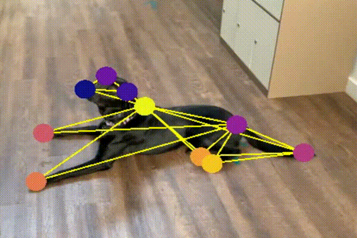

# 🐕 dog-pose-estimation


As a fun weekend project, I developed a pose estimation model with my dog using [DeepLabCut](http://www.mackenziemathislab.org/deeplabcut). DLC is a free and open source toolkit that enables researchers to estimate the pose of a subject. DLC leverages transfer learning, which is the ability to take a fully trained neural network model — which was trained with a large supervised data set — and re-train it with a smaller set of images.  

Using the DLC Python toolkit, I was able to collect and label ~100 images of my dog Coco to re-train an accurate pose estimation model without needing a GPU or extensive programming experience. The toolkit made it easy to extract videos taken on my iPhone, annotate frames, train a model with TensorFlow, analyze and refine the model, and generate labeled videos that track Coco's pose with markers and show an outline of her skeleton.  


📖 Read: [Nath*, Mathis* et al., 2019](https://www.biorxiv.org/content/10.1101/476531v1)  
📺 Watch: [Mackenzie Mathis: DeepLabCut Tech Demo](https://youtu.be/iKazf5F7bPU)  
💻 Try DLC: https://github.com/DeepLabCut/DeepLabCut    


## Step 1 - Collect Video  
The first step is to collect videos of your dog. I took both indoor and ourdoor videos of Coco from many different angles with my iPhone X. Because I eventually want to detect her position based on pose (standing, sitting and down-stay), took video in each position.  

## Step 2 - Install DeepLabCut (DLC) Toolkit  
For this experiment, I used my Ubuntu 20.04 desktop with an Intel(R) Core(TM) i7-10700K CPU @ 3.80GHz and 128GB of RAM (No GPU required).  

To set up my environment, I used the [conda file for CPU](https://camo.githubusercontent.com/6c3abf3851b6d793dbf2d42a76a55cf00149af1a02c50e32416d1dd1d924e84c/68747470733a2f2f696d616765732e73717561726573706163652d63646e2e636f6d2f636f6e74656e742f76312f3537663664353163396637343536366635356563663237312f313538323736333037303734322d5134354e544f3642354e565849534251553954492f6b6531375a77644742546f6464493870446d34386b436e394a4f452d5a6f36795a5251774c32395a4a525555717378525571716272316d4f4a594b66495052374c6f4451396d58504f6a6f4a6f71793831533249384e5f4e34563176556235416f494949624c5a68565979374d797468705f542d6d746f702d767273554f6d65496e50693969446a783977384b345a666a587432646e4a6135637a4f69492d5033755a65507162594233573151567436737151313156464267742d47697a3239436a4c4953774273386545647841785470745a4155672f636f6e64616578616d706c652e706e673f666f726d61743d3235303077) provided by DeepLabCut to create an environment called `DLC-CPU`. This environment will use `python=3.7` `tensorflow=1.13.1` and `wxPython<4.1.0`. There is also a conda file for GPU, which uses `tensorflow-gpu=1.13.1`. See more detailed instructions in the [DLC docs](https://github.com/DeepLabCut/DeepLabCut/blob/master/conda-environments/README.md) 

1. Install [Anaconda 3](https://www.anaconda.com/distribution/) if you don't have it already
2. Download DLC's [conda file for CPU](https://camo.githubusercontent.com/6c3abf3851b6d793dbf2d42a76a55cf00149af1a02c50e32416d1dd1d924e84c/68747470733a2f2f696d616765732e73717561726573706163652d63646e2e636f6d2f636f6e74656e742f76312f3537663664353163396637343536366635356563663237312f313538323736333037303734322d5134354e544f3642354e565849534251553954492f6b6531375a77644742546f6464493870446d34386b436e394a4f452d5a6f36795a5251774c32395a4a525555717378525571716272316d4f4a594b66495052374c6f4451396d58504f6a6f4a6f71793831533249384e5f4e34563176556235416f494949624c5a68565979374d797468705f542d6d746f702d767273554f6d65496e50693969446a783977384b345a666a587432646e4a6135637a4f69492d5033755a65507162594233573151567436737151313156464267742d47697a3239436a4c4953774273386545647841785470745a4155672f636f6e64616578616d706c652e706e673f666f726d61743d3235303077)
3. Open terminal where you placed the file and run `conda env create -f DLC-CPU.yaml`

## Step 3 - Create and Configure DLC Project

### Create the Project

```python
deeplabcut.create_new_project('ProjectName','YourName', ['/Users/FullPath/OfVideo1.mov', '/Users/FullPath/OfVideo2.mov', '/Users/FullPath/OfVideo1.mov'],
              copy_videos=True, multianimal=False)
```

### Define Body Parts

Edit the config.yaml to add body parts. These are the parts that I used for my dog:

```
bodyparts:
- nose
- leftear
- rightear
- collar
- spine1
- spine2
- spine3
- tailstart
- tailend
- frontleftleg
- frontleftpaw
- frontrightleg
- frontrightpaw
- backleftleg
- backleftpaw
- backrightleg
- backrightpaw
```

### Set config_path

For the next steps, you will use the environment variable `config_path`.

```python
config_path = '/Users/FullPath/DeepLabCut/yourprojectname/config.yaml'
```

## Step 4 - Label Video Frames


### Select Frames to Label:

```python
deeplabcut.extract_frames(config_path, mode='automatic', algo='kmeans', crop=False)
```

### Label Frames

Use the DLC Labeling Toolbox to label frames. DLC will automatically select frames from the video(s) you import using kmeans quantization. It will also downsample the frames before annotation.

### Build Skeleton

## Step 5 - Create Training Dataset

## Step 6 - Train the Model

## Step 7 - Evaluate the Model

## Step 8 - Create Labeled Video


